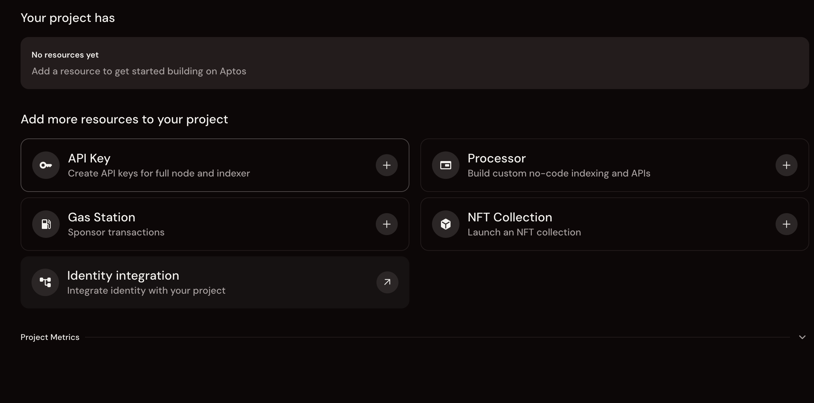
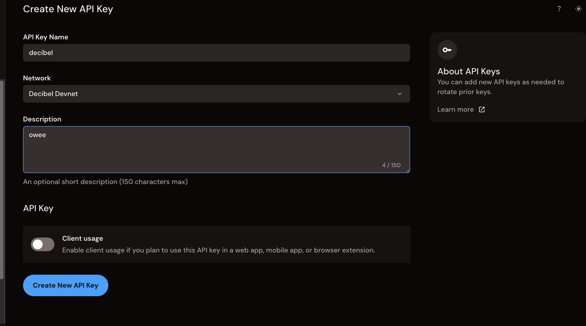
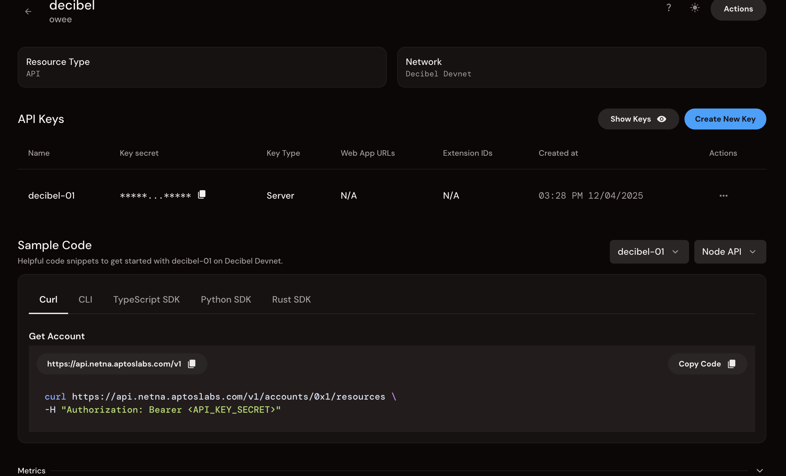

# Decibel Trading Starter Kit

A complete, working reference implementation for programmatic trading on Decibel.

**Goal:** Get a bot running on testnet in < 5 minutes, then teach you how to customize it.

## Part 1: The "Quick Win" (Relax Mode) 🚫🧠

Follow these steps exactly to get your first trade running.

### 1. Prerequisites
- [ ] **Node.js 18+** installed
- [ ] **Petra Wallet** browser extension installed (recommended, but optional thanks to Aptos Connect)
- [ ] **Git** installed
- [ ] [**Aptos CLI** (recommended)](https://aptos.dev/build/cli#-install-the-aptos-cli)

### 2. Get Your Credentials

You need two things: an API Wallet (for signing transactions) and an API Key (for authenticated API requests).

#### 2a. Create API Wallet

1.  Go to [Decibel App (Staging)](https://app.decibel.trade/api).
2.  Connect your Petra Wallet or "Continue with Google."
3.  Click **"Create API Wallet"**.

4.  **Copy the Private Key** immediately (you only see it once).
5.  Also save the **Wallet Address** shown on the same screen.

#### 2b. Create API Key (Bearer Token)

The API Key is used for authenticated requests to the Decibel REST API. You'll get this from Geomi (Aptos Build).

1.  **Sign up or log in** at [geomi.dev](https://geomi.dev)
    - Click "Continue with Google" or enter your email

2.  **Create or select a project**
    - If you're new, you'll see "No resources yet" - that's fine!
    - Your project dashboard will show available resources

3.  **Add an API Key resource**
    
    - Click the **"API Key"** card (find it under "Add more resources to your project")

4.  **Fill out the API Key form:**
    
    - **API Key Name:** Choose a name (e.g., `decibel` or `my-trading-bot`)
    - **Network:** Select **"Decibel Devnet"** from the dropdown (important!)
    - **Description:** Optional - add a note about what this key is for (150 chars max)
    - **Client usage:** Leave this **OFF** (unless you're building a web/mobile app)
    - Click **"Create New API Key"**

5.  **Copy your Bearer Token**
    
    - After creation, you'll see your API key in the "API Keys" table
    - Find the **"Key secret"** column - this is your Bearer token
    - Click the copy icon next to the masked key (shows as `*****...*****`)
    
    **Important:** This is the value you'll use as `API_BEARER_TOKEN` in your `.env` file. It's the full Bearer token, not just the key name.

### 3. Configure the Project

Run these commands in your terminal:

```bash
# Clone the repo (we will have this on aptos/decibel eventually)
git clone https://github.com/tippi-fifestarr/testetna.git
cd testetna

# Install dependencies
npm install

# Create env file
cp .env.example .env
```

Open `.env` and paste your credentials:
```env
API_WALLET_PRIVATE_KEY=0xYOUR_COPIED_KEY_HERE
API_WALLET_ADDRESS=0xYOUR_WALLET_ADDRESS_HERE
API_BEARER_TOKEN=YOUR_BEARER_TOKEN_HERE
```

**Quick checklist:**
- [ ] `API_WALLET_PRIVATE_KEY` - From Decibel App (step 2a)
- [ ] `API_WALLET_ADDRESS` - From Decibel App (step 2a)  
- [ ] `API_BEARER_TOKEN` - Bearer token from Geomi (step 2b, "Key secret" column)

### 4. Run the "Quick Win"
This script handles everything: funding (via private faucet), account creation, minting USDC, depositing, and placing a trade. It's running the scripts in `src/`.

```bash
npm run quick-win
```

**If you see "🎉 Order Placement Complete!", congratulations. The code works.**

---

## Part 2: Make It Yours (Brain On) 🧠✅

Now that you have a working baseline, here is how to adapt this code for your actual strategy.

### How to Trade a Different Market
Open [`src/4-place-order.ts`](./src/4-place-order.ts).
Find the "Configuration" section (around line 63).

**Change this:**
```typescript
const marketName = config.MARKET_NAME || 'BTC/USD';
```

**To this (example):**
```typescript
const marketName = 'ETH/USD'; // or SOL/USD, APT/USD, etc.
```
*Note: Run `npm run setup` to see a list of all available market names. Market names use the format `SYMBOL/USD` (not `SYMBOL-PERP`).*

### How to Change Your Order Logic
Open [`src/4-place-order.ts`](./src/4-place-order.ts).
Find the "Order Parameters" section.

**Change this:**
```typescript
const userPrice = 50000;
const userSize = 0.001;
const isBuy = true;
```

**To your own logic:**
```typescript
// Example: A simple moving average bot might look like this
const userPrice = calculatedMovingAverage;
const userSize = riskManagementSize;
const isBuy = signal === 'BULLISH';
```

### How to Use a Different Subaccount
If you want to use a specific subaccount (e.g., for a different strategy):

1.  Create a new one: `npm run create-subaccount`
2.  The script automatically updates your `.env` file with the new `SUBACCOUNT_ADDRESS`.
3.  Run `npm run deposit-usdc` to fund it.

**How the subaccount script works:**
- The script calls `create_new_subaccount`, which creates a **non-primary** subaccount (random address)
- It then queries the API (with up to 5 retries) to get the subaccount address
- It uses the **most recently created** subaccount from the API response
- If the API fails after all retries, it falls back to the calculated **primary** subaccount address
- The address is automatically written to your `.env` file

**To manually select a different subaccount:**
- After running `create-subaccount`, check the list of subaccounts it prints
- Manually edit `.env` and set `SUBACCOUNT_ADDRESS` to the address you want
- Or modify [`src/2-create-subaccount.ts`](./src/2-create-subaccount.ts) to change the selection logic (around line 129)

See the [source folder](./src/) for all the scripts `quick-win` is running, such as [3-deposit-usdc](./src/3-deposit-usdc.ts) (used above). 

---

## Part 3: Mental Model & Architecture 🏗️

Trading on Decibel has specific mechanics that differ from CEXs. Here are 3 key concepts for API traders.

### 1. The Three-Tier Account Model
Decibel uses a three-tier account structure for programmatic trading:

*   **Primary Wallet (Petra/Google):** Your login account. Used to access Decibel App and create API Wallets.
*   **API Wallet:** A separate wallet you create at `app.decibel.trade/api` for programmatic trading. This wallet:
    - Has its own address (e.g., `0x8096fc...`)
    - Holds APT for gas fees
    - Signs all your trading transactions
    - This is what you set as `API_WALLET_ADDRESS` in your `.env` file
*   **Subaccount:** A derived address calculated from your API Wallet. This account:
    - Holds USDC for trading collateral
    - Is automatically calculated and written to `.env` as `SUBACCOUNT_ADDRESS`
    - Different address from your API Wallet

**Flow:** Primary Wallet → Create API Wallet → Create Subaccount → Deposit USDC → Trade.

**Note:** For programmatic traders, you primarily interact with the **API Wallet** (not the Primary Wallet). The Primary Wallet is just for logging in and creating API Wallets.

### 2. Async Execution (The Queue)
Decibel is an on-chain CLOB.
*   **CEX:** `response = placeOrder()` -> Returns "Filled".
*   **Decibel:** `response = placeOrder()` -> Returns "Transaction Hash" (Ticket to the Queue).

**Implication:** Execution is asynchronous. The REST response confirms *submission*, not *fill*. Use the WebSocket stream for deterministic execution updates.
*   [See WebSocket Docs](https://docs.decibel.trade/api-reference/websockets/orderupdate)

### 3. "Lazy" Continuous Funding
*   **Traditional:** You pay funding every 8 hours.
*   **Decibel:** Funding ticks every second (continuous accrual).
*   **The Mechanic:** You only "pay" (settle) when you modify or close the position.
*   **Risk:** Your `Unrealized PnL` includes this accrued funding debt. Watch it closely to avoid liquidation.
*   [See Position Management Docs](https://docs.decibel.trade/architecture/perps/position-management)

### 4. Reduce-Only Logic
Decibel implements strict "Close First" logic.
*   **The Mechanic:** A Reduce-Only order will never flip your position (e.g. Long 1 -> Short 1). It caps execution at your current size.
*   **Benefit:** Prevents accidental exposure when closing positions aggressively.
*   [See Order Management Docs](https://docs.decibel.trade/transactions/overview)

### 5. Bulk Orders (Unique Optimization)
For Market Makers and HFTs:
*   **The Mechanic:** You can update multiple orders in a single transaction.
*   **Benefit:** Massive gas savings and atomic updates for spread management.
*   [See Bulk Order Docs](https://docs.decibel.trade/transactions/order-management/place-bulk-order)

---

## Part 4: What's Next? 🚀

1.  **Monitor Risk:** Build a script to track `Unrealized PnL` + `Accrued Funding` to avoid liquidation.
2.  **Market Making:** Use `src/6-websocket-updates.ts` to listen to the orderbook and place Maker orders.
3.  **Explore Order Types:** Look into `Post-Only` and `Reduce-Only` params in the API docs for advanced control.

### Resources
*   [Official Documentation](https://docs.decibel.trade)
*   [Discord Community](https://discord.com/invite/decibel)
*   [Netna Faucet (Staging)](https://faucet-dev-netna-us-central1-410192433417.us-central1.run.app)
